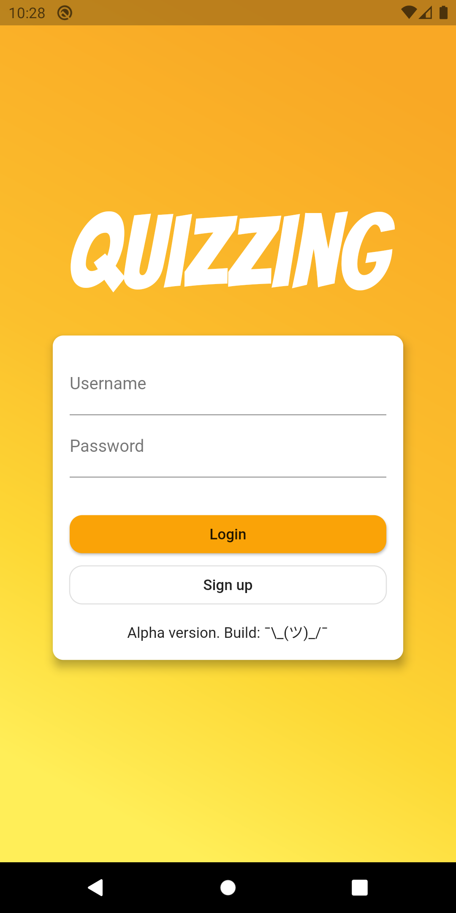
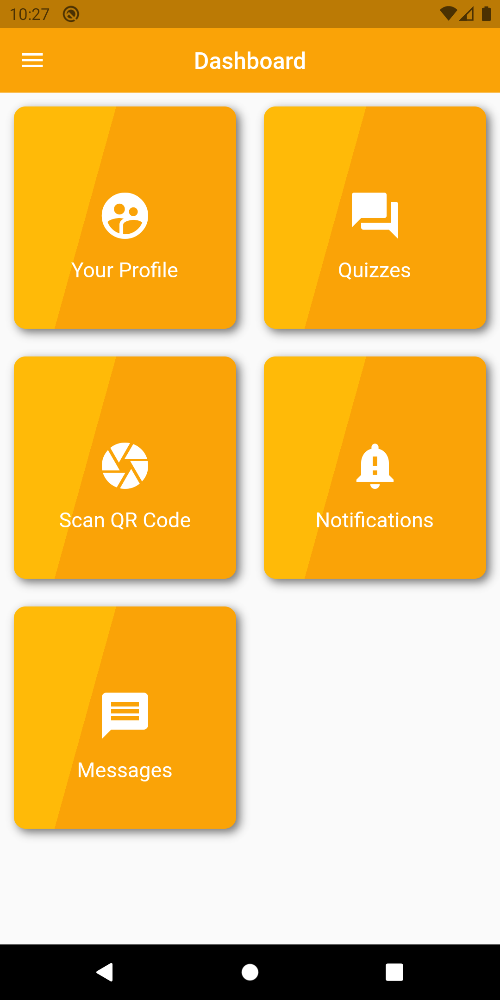
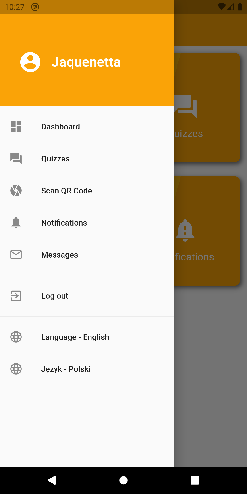
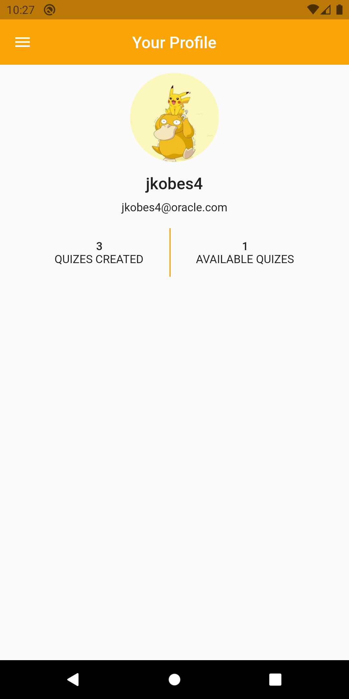
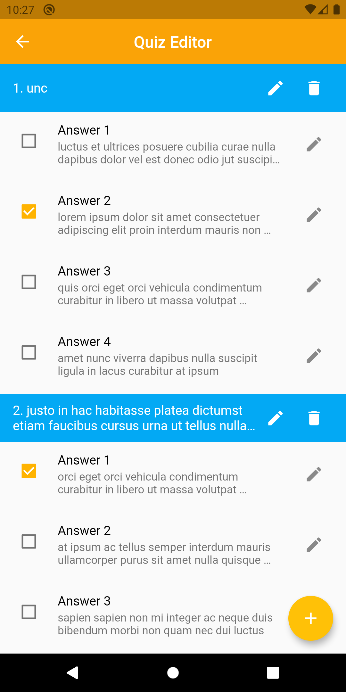
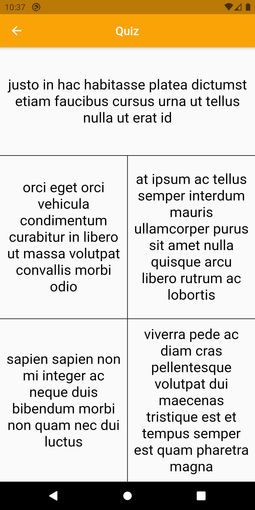
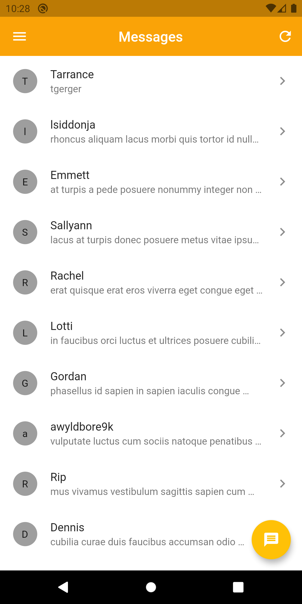
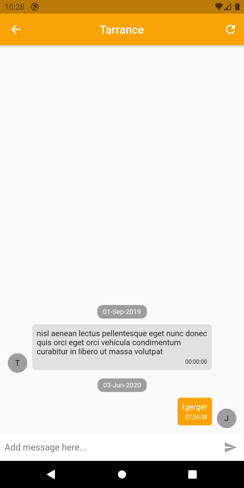

# Quizzing

## Introduction

Quizzing is a mobile application created for creating quizzes. It's main purpose is to help students study for exams.

## Getting Started

### Installation

1. Create `.env` file and specify `API_PORT`, `DB_PORT`, `DB_API_PASSWORD`, `DB_ROOT_PASSWORD`. Example:
```bash
API_PORT=3000
DB_PORT=3306
DB_API_PASSWORD=test123
DB_ROOT_PASSWORD=123test
```

2. Launch containers with:
```bash
docker-compose up -d
```

3. Install mobile app using `flutter install` or use sample `.apk`.

## Usage

### API

API has built in explorer on `/explorer` page. It's easy to use!

### Mobile App

Mobile app was built in a simplest way possible. You can do this!

## Screenshots









